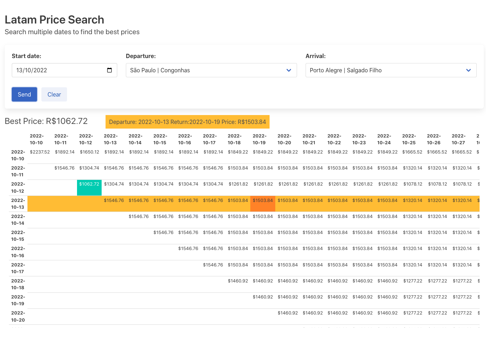

# Latam Price Checker
This is a simple app using **Python/Fastapi** for the backend to deliver all price combinations when searching for an airline ticket.

It searches for 21 days from the start date and compiles all the prices into a table.

Backend:
- Python using FastApi

### Instalation:
- Download the git repo
- create Virtual Environment and activate it
- Install requirements.txt `pip install -r requirements.txt`
- Load the server `uvicorn main:app --reload`
- Open http://127.0.0.1:8000  in your browser